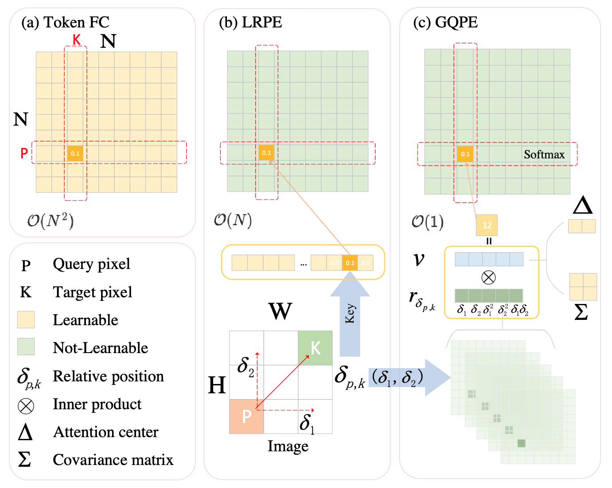

# Parameterization of Cross-Token Relations with Relative Positional Encoding for Vision MLP

This is a Pytorch implementation of our paper. We have presented a new gating unit PoSGU 
which  replace the FC layer in SGU of [gMLP](https://proceedings.neurips.cc/paper/2021/hash/4cc05b35c2f937c5bd9e7d41d3686fff-Abstract.html) with relative positional encoding methods (Spercifically, LRPE and GQPE) and used it
as the key building block to develop a new vision MLP architecture
referred to as the PosMLP. We also hope this work will inspire further theoretical study of positional encoding
in vision MLPs and could have a mature application as in vision
Transformers.



Our code is based on the [pytorch-image-models](https://github.com/rwightman/pytorch-image-models), [attention-cnn](https://github.com/epfml/attention-cnn), [swim-transformer](https://github.com/microsoft/Swin-Transformer),[vision-Permutator](https://github.com/Andrew-Qibin/VisionPermutator)

### Comparison with Recent MLP-like Models
| Model        | Parameters | Image resolution | Top 1 Acc. | Download |
| :----------- | :--------- | :--------------- | :--------- | :------- |
| gMLP-S       | 20M        | 224              | 79.6%      |          |
| Hire-MLP-S   | 33M        | 224              | 81.8%      |          |
| ViP-Small/7  | 25M        | 224              | 81.5%      |          |
| **PosMLP-T** | 21M        | 224              | 82.1%      |released soon|
| S2-MLP-deep  | 51M        | 224              | 80.7%      |          |
| Mixer-B/16   | 59M        | 224              | 78.5%      |          |
| ViP-Medium/7 | 55M        | 224              | 82.7%      |          |
| AS-MLP-S     | 50M        | 224              | 83.1%      |          |
| **PosMLP-S** | 37M        | 224              | 83.0%      |released soon|
| gMLP-B       | 73M        | 224              | 81.6%      |          |
| ResMLP-B24   | 116M       | 224              | 81.0%      |          |
| ViP-Large/7  | 88M        | 224              | 83.2%      |          |
| Hire-MLP-L   | 96M        | 224              | 83.4%      |          |
| **PosMLP-B** | 82M        | 224              | 83.6%      |          |


The experiments are conducted on 8 RTX 3090 gpus.
### Requirements

```
torch>=1.4.0
torchvision>=0.5.0
pyyaml
timm==0.4.5
apex if you use 'apex amp'
```

data prepare: ImageNet with the following folder structure, you can extract imagenet by this [script](https://gist.github.com/BIGBALLON/8a71d225eff18d88e469e6ea9b39cef4). Please update the data folder path in config files.

```
│imagenet/
├──train/
│  ├── n01440764
│  │   ├── n01440764_10026.JPEG
│  │   ├── n01440764_10027.JPEG
│  │   ├── ......
│  ├── ......
├──val/
│  ├── n01440764
│  │   ├── ILSVRC2012_val_00000293.JPEG
│  │   ├── ILSVRC2012_val_00002138.JPEG
│  │   ├── ......
│  ├── ......
```

<!-- ### Validation
Replace DATA_DIR with your imagenet validation set path and MODEL_DIR with the checkpoint path
```
CUDA_VISIBLE_DEVICES=0 bash eval.sh /path/to/imagenet/val /path/to/checkpoint
``` -->

### Training

Command line for training PosMLP-T on 8 GPUs (RTX 3090)
```
bash distributed_train.sh
```


<!-- ### Reference
You may want to cite:
```
@misc{hou2021vision,
    title={Vision Permutator: A Permutable MLP-Like Architecture for Visual Recognition},
    author={Qibin Hou and Zihang Jiang and Li Yuan and Ming-Ming Cheng and Shuicheng Yan and Jiashi Feng},
    year={2021},
    eprint={2106.12368},
    archivePrefix={arXiv},
    primaryClass={cs.CV}
}
``` -->


### License
This repository is released under the MIT License as found in the [LICENSE](LICENSE) file.
